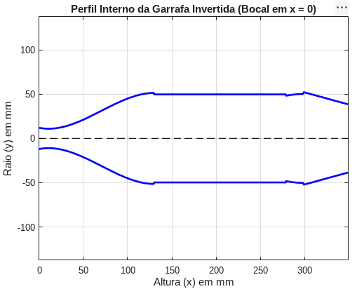

# Simulador de Variação de CG por Efeito de Sloshing em Reservatório Axissimétrico de 2L

Algoritmo desenvolvido em MATLAB para cálculo da variação do Centro de Gravidade (CG) em um reservatório axissimétrico parcialmente cheio e determinação do CG global do sistema (Aeronave + Carga Líquida) sob variações no ângulo de ataque.

---

## 1. Modelagem Geométrica do Reservatório

Para o cálculo preciso da variação do CG, foi necessária a modelagem do raio da garrafa ($R$) ao longo do seu comprimento total de $349\text{ mm}$. A geometria foi dividida em quatro seções contínuas longo do eixo longitudinal $X$:

1. **Bocal ($0 \le x \le 130\text{ mm}$):** Perfil cúbico $R(x) = ax^3 + bx^2 + cx + d$, calculado através do sistema linear de derivadas e condições de contorno de posição e inclinação.
2. **Corpo Cilíndrico ($130 < x \le 279\text{ mm}$):** Raio constante ($R = 49{,}70\text{ mm}$).
3. **Transição Parabólica ($279 < x \le 299\text{ mm}$):** Perfil quadrático $R(x_{\text{orig}}) = -0{,}00495 x_{\text{orig}}^2 + 0{,}495 x_{\text{orig}} + 37{,}825$, ajustado para melhor modelar a curvatura da transição.
4. **Fundo Cônico ($299 < x \le 349\text{ mm}$):** Perfil linear $R(x_{\text{orig}}) = 38{,}50 + 0{,}274 x_{\text{orig}}$.

---

## 2. Metodologia e Abordagem Física

A partir da modelagem geométrica, do ângulo de ataque ($\alpha$) e do volume de água inserido no reservatório da aeronave (definidos pelo usuário), utiliza-se a rotina de cálculo de volume para encontrar a linha de superfície livre do fluido. 

> **Nota de Modelagem:** O algoritmo utiliza uma referência relativa: em vez de rotacionar a geometria do reservatório, a garrafa é mantida fixa no referencial local enquanto se modela a inclinação da lâmina d'água sob o ângulo $\alpha$.

### Hidrostática de Segmentos Circulares Parciais
Para uma superfície livre do líquido descrita pela reta $h(x) = m \cdot x + b$, onde $m = \tan(\alpha)$:

* **Ângulo central da lâmina d'água ($\theta_c$):** 
  $$\theta_c = 2 \arccos\left(-\frac{h}{R}\right)$$
* **Área molhada da fatia ($A_{\text{fatia}}$):** 
  $$A_{\text{fatia}} = \frac{1}{2} R^2 (\theta_c - \sin\theta_c)$$
* **Centroide vertical local ($z_{\text{fatia}}$):** 
  $$z_{\text{fatia}} = -\frac{2}{3} \frac{R^3 \sin^3(\theta_c / 2)}{A_{\text{fatia}}}$$

### Método da Bissecção (Enquadramento de Raízes)
A altura da superfície livre $b$ é determinada iterativamente através do Método da Bissecção. O algoritmo busca o coeficiente linear $b$ no intervalo $[-200, 200]\text{ mm}$ até que o volume integrado atinja o volume alvo $V_{\text{alvo}}$ com erro absoluto inferior a $10^{-4}\text{ L}$ ($0{,}1\text{ mL}$).

### Integração de Riemann
A quadratura numérica ao longo do eixo longitudinal utiliza discretização finita com passo $\Delta x = 0{,}01\text{ mm}$, calculando os momentos estáticos de primeira ordem e o volume total:

$$V = \sum A_i \, \Delta x$$

$$X_{cg} = \frac{\sum (A_i \, \Delta x \cdot x_i)}{V}, \quad Z_{cg} = \frac{\sum (A_i \, \Delta x \cdot z_i)}{V}$$

### Teorema de Varignon (Composição de Momentos)
A posição final do Centro de Gravidade do sistema composto (Aeronave Vazia + Carga Líquida) é obtida pelo princípio da equivalência de momentos estáticos:

$$X_{cg, \text{total}} = \frac{m_{\text{aero}} X_{\text{aero}} + m_{\text{líquido}} X_{\text{líquido}}}{m_{\text{aero}} + m_{\text{líquido}}}$$

$$Z_{cg, \text{total}} = \frac{m_{\text{aero}} Z_{\text{aero}} + m_{\text{líquido}} Z_{\text{líquido}}}{m_{\text{aero}} + m_{\text{líquido}}}$$

---

## 3. Capacidades de Cálculo do Algoritmo

1. **Definição de Volume Flexível:** Conservação de massa rigorosa para qualquer volume contido no limite do reservatório (até 2L).
2. **Referência de Calibração (0°):** Determinação da altura do fluido a $0^\circ$ de inclinação para aferição visual e validação experimental em bancada.
3. **Deslocamento Dinâmico do CG da Carga ($\Delta X, \Delta Z$):** Variação tridimensional do centro de massa do fluido sob diferentes ângulos de atitude ($\alpha$).
4. **Propriedades Globais do Veículo:** Massa total instantânea e vetor de posição do CG do conjunto ajustado após a redistribuição da massa líquida.
